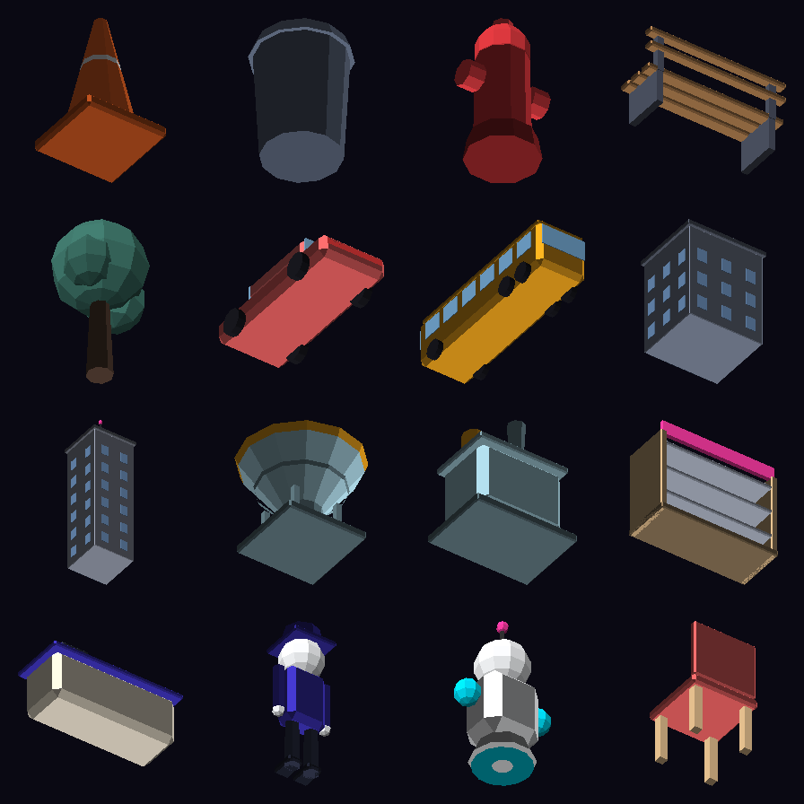

# Art direction — "Neon Dusk Retail"

The brief asked for a theme borrowed from the genre's best-looking games: the flat, readable
city of an arena-eater crossed with the candy-bright shop interiors of an idle retail game.
The palette is taken from the technical specification's own brand colours, so the game and its
design document look like the same product.

## Palette

| Role | Colour | Used for |
|------|--------|----------|
| Void Ink | `#0B0A14` | The hole itself, splash background, deep shadow |
| Void Indigo | `#2D1B4E` | Pit walls, HUD pills, modal ink |
| Electric Violet | `#4338CA` | Primary buttons, upgrade cards, structural accents |
| Neon Cyan | `#00E5FF` | Event horizon, gauges, highlights, shop trim |
| Hot Magenta | `#FF3DA6` | Secondary neon, signage, warnings that should feel fun |
| Sunset Amber | `#FFB020` | Rewards, street lighting, taxi paint |
| Mint | `#3DDC97` | Money, success, affordability |
| Coral | `#FF6B6B` | Jams, failures, hot props |
| Paper / Cream | `#F8FAFC` / `#FFF4E0` | Text, shop walls and floors |

**Street** colours are deliberately desaturated slate-blues so that a traffic cone or a hydrant
reads instantly as food. **Shop** colours are warm pastels so the interior feels like a different
place without a loading screen.

## How the art is made

Nothing is imported. Four generators build everything:

- **`MeshBuilder` + `MeshLibrary`** — a transform-stack construction kit (chamfered boxes,
  cylinders, spheres, rings, wedges, tubes) that authors ~55 meshes. Faces never share vertices,
  so the facets stay hard and the low-poly read is crisp. Colour is baked into vertex colours,
  which is what lets the entire world share one material.
- **`TexturePainter`** — a small signed-distance-field rasteriser (rounded rect, circle, ring,
  capsule, polygon, star, plus blur, grain, shadow and erase). Every sprite, icon, gauge and
  ground texture is drawn with it, so they anti-alias cleanly at any size.
- **`FontGenerator`** — the display typeface, defined as stroke paths on a cap-height grid and
  rasterised with rounded caps. Weight and corner rounding are sliders, so the whole UI's voice
  can be re-tuned without touching a font file.
- **`AudioSynth` + `AudioLibrary`** — oscillators, ADSR envelopes, a one-pole filter and a
  Schroeder reverb, composing three music loops and twelve effects.

## The prop set

Rendered from the generators, not from Unity — the same geometry the build produces:

## Shading

`VoidMart/ClayLit` is a wrapped-diffuse surface: a soft `saturate((N·L + wrap) / (1 + wrap))`
term tinted toward a shade colour in the dark, a rim light to separate objects from the
background, and a small specular for the vinyl-toy sheen. It carries stencil parameters so the
same shader is the punched street, the shop floor and every prop.

## Restyling

1. Open **Tools ▸ Void Mart ▸ Master Control ▸ Theme & Art**.
2. Change any colour, or the clay wrap / rim / specular values.
3. Press **Rebuild art from palette**.

The meshes, textures, icons, font atlas, materials and prefabs are regenerated in place. Scenes
keep working because nothing's GUID changes.

To hand-author art instead, open the **Assets** tab and drop your own mesh, sprite, material or
prefab onto any registry row — the game resolves art by key, so a replacement is picked up
without touching code.
