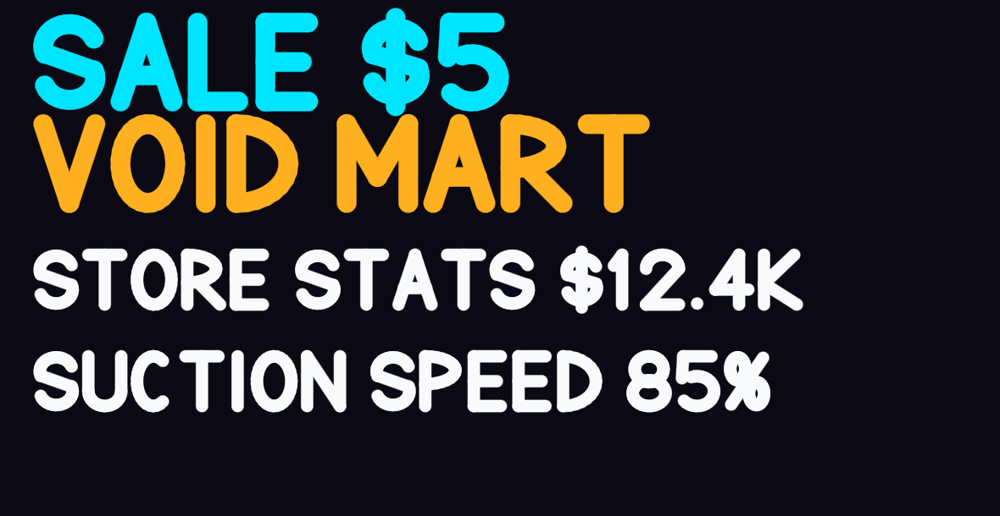
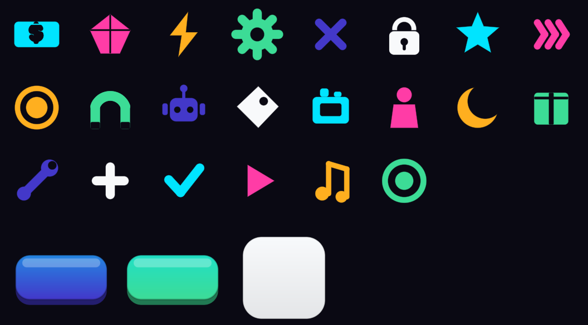

# Void Mart — Eat & Earn

A hybrid-casual mobile game for **Unity 6 (URP)**: you are a sentient black hole that eats a city
street to feed a retail empire, then runs the shop that sells what the city becomes.

> **Gather** the street with a one-finger joystick → **Unload** into the factory hoppers →
> **Craft & Sell** to stickman shoppers while you drive back out → **Unjam** a machine with a
> five-second block-sorting puzzle when the line stops.

Everything in this repository is source. There are no imported art, audio or scene files: the
meshes, textures, icons, display typeface, music and both scenes are **generated by one menu
item**, and every value behind them stays editable in a dedicated tool window.

---

## Getting started

1. Open the project in **Unity 6000.3.17f1** (or newer Unity 6).
2. Menu: **Tools ▸ Void Mart ▸ Build Everything (One-Click Setup)**.
3. When it finishes, the Game scene opens. Press **Play**.

The build takes roughly half a minute. It creates:

| Step | What it makes |
|------|---------------|
| Configuration | `GameConfig`, `GameAssets`, the ScriptableObject event bus and its channels |
| Project settings | Layers, tags, portrait orientation, build list, URP depth-priming fix |
| Content | Prop / product / upgrade tables and the store's furnishing nodes |
| Meshes | ~55 flat-shaded low-poly meshes (props, vehicles, buildings, machines, characters) |
| Art | Sprites, icons, gauges, the street and shop-floor textures, and the display font atlas |
| Materials | The clay surface, stencil mask, pit interior, sky, glow and iris materials |
| Audio | Three seamless music loops and twelve sound effects, synthesised to WAV |
| Prefabs | Every runtime prefab, fully wired |
| Scenes | `Boot.unity` (services + splash) and `Game.unity` (the whole world) |

Re-running it is safe: assets are rewritten **in place**, so scene and prefab references survive.

## The Master Control window

**Tools ▸ Void Mart ▸ Master Control** (`Ctrl/Cmd + Shift + V`) is the tuning surface:

- **Dashboard** — build status and per-system rebuild buttons.
- **Tweakables** — every `[Tweakable]` value in the game as a labelled slider, grouped by
  category. The same attribute drives the in-game debug panel, so annotating a field once
  surfaces it in both places.
- **Balance / Hole & Camera / City / Store / Puzzle / Interface / Monetization** — the full
  config sections with inline help.
- **Content** — the props, products and upgrades tables.
- **Store Nodes** — every furnishing node: position, cost, dependencies and what it produces.
- **Theme & Art** — the palette and generation settings, with "rebuild art from palette".
- **Audio** — mix, synthesis parameters and clip preview.
- **Assets** — the generated asset registry; swap any entry for your own mesh, sprite,
  material or prefab and the game picks it up by key.
- **Debug** — save file tools and play-mode cheats.

In play mode, **F1** (or a three-finger double tap on device) opens the runtime tweaker.

## Controls

| Input | Action |
|-------|--------|
| Drag anywhere on the lower screen | Move the hole (floating joystick) |
| Drive over props | Eat anything smaller than the hole |
| Drive onto the hopper pad | Unload; the transfer rate drives the audio and the bills |
| Drive onto a glowing pad | Buy that store node — cash drains faster the longer you stand |
| Drive near a jammed machine | Opens the five-second unjam puzzle |
| Drag a tray piece onto the board | Place it; completing a line repairs the machine and pays out |

## Art direction

**"Neon Dusk Retail"** — clay-shaded low-poly, built on the spec document's own brand colours:

| | | |
|---|---|---|
| Void Ink `#0B0A14` | Void Indigo `#2D1B4E` | Electric Violet `#4338CA` |
| Neon Cyan `#00E5FF` | Hot Magenta `#FF3DA6` | Sunset Amber `#FFB020` |
| Mint `#3DDC97` | Coral `#FF6B6B` | Paper `#F8FAFC` |

The street outside is deliberately desaturated so collectibles pop; the shop inside is bright
commercial pastel. Every colour lives in `GameConfig.theme`, and "rebuild art from palette"
re-renders the meshes, textures, icons and font in the new scheme.

The display typeface is drawn from stroke paths at build time — no font import:





## Repository layout

```
Assets/VoidMart/
  Runtime/          Game code (asmdef: VoidMart.Runtime)
    Core/           Service locator, event bus, pooling, JSON, easing, input
    Data/           GameConfig, GameAssets, save model, node + font assets
    Services/       Save (AES-GCM), economy, audio
    Gameplay/       Hole controller, swallow physics, city generator, camera
    Store/          Hoppers, machines, shelves, customers, register, robots, pads
    Puzzle/         Grid model, piece set, the unjam session
    UI/             Text renderer, HUD, modals, joystick, iris wipe, toasts
    Monetization/   Ad / IAP / platform interfaces and local stand-ins
    Tweaker/        [Tweakable] attribute, reflection engine, debug overlay
  Editor/           Generators and the Master Control window (asmdef: VoidMart.Editor)
  Shaders/          Clay lit, hole stencil mask, pit interior, sky, iris, unlit
  Generated/        Everything the one-click build produces (safe to delete)
Docs/               Architecture, art direction and the design spec mapping
Tools/cslint.py     Structural checker for the C# sources
```

## Documentation

- [`Docs/ARCHITECTURE.md`](Docs/ARCHITECTURE.md) — systems, the event bus, save format, generation order.
- [`Docs/ART_DIRECTION.md`](Docs/ART_DIRECTION.md) — the palette, how the art is generated, how to restyle it.
- [`Docs/SPEC_MAPPING.md`](Docs/SPEC_MAPPING.md) — where each section of the technical spec landed, and the deviations.
- [`Docs/FIRST_RUN.md`](Docs/FIRST_RUN.md) — what a correct first run looks like, and what to do if it does not.
